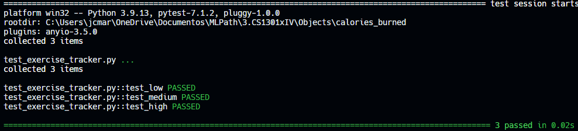
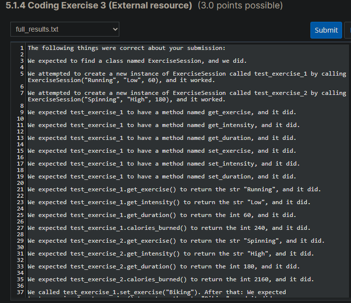

# Calories Burned

## Problem Description

Previously, you wrote a class called ExerciseSession that had three attributes: an exercise name, an intensity, and a duration.
Add a new method to that class called calories_burned. calories_burned should have no parameters (besides self, as every method in a class has). It should return an integer representing the number of calories burned according to the following formula:
- If the intensity is "Low", 4 calories are burned per minute.
- If the intensity is "Medium", 8 calories are burned per minute.
- If the intensity is "High", 12 calories are burned per minute.

You may copy your class from the previous exercise and just add to it.

## My solution

#### exercise_tracker.py

```python
class ExerciseSession:
    def __init__(self, name, intensity, length):
        self.name = name
        self.intensity = intensity
        self.length = length
        
        
    def get_exercise(self):
        return self.name
    
    
    def get_intensity(self):
        return self.intensity
    
    
    def get_duration(self):
        return self.length
    
    
    def set_exercise(self, name):
        self.name = name
        
        
    def set_intensity(self, intensity):
        self.intensity = intensity
        
        
    def set_duration(self, length):
        self.length = length

        
    def calories_burned(self):
        if self.intensity == "Low":
            return 4 * self.length
        elif self.intensity == "Medium":
            return 8 * self.length
        else:
            return 12 * self.length
```

#### test_exercise_tracker.py

```python
from exercise_tracker import ExerciseSession


def test_low():
    ex = ExerciseSession("one", "Low", 10)
    assert ex.calories_burned() == 40


def test_medium():
    ex = ExerciseSession("one", "Medium", 10)
    assert ex.calories_burned() == 80


def test_high():
    ex = ExerciseSession("one", "High", 10)
    assert ex.calories_burned() == 120
```

## Tests



## Score



## Usage

1. Run 'python exercise_tracker.py'.