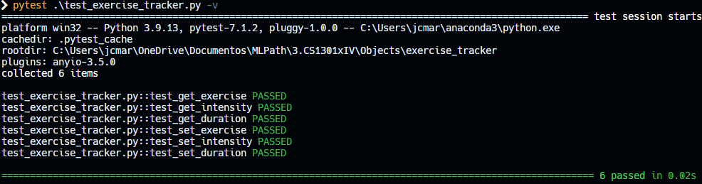
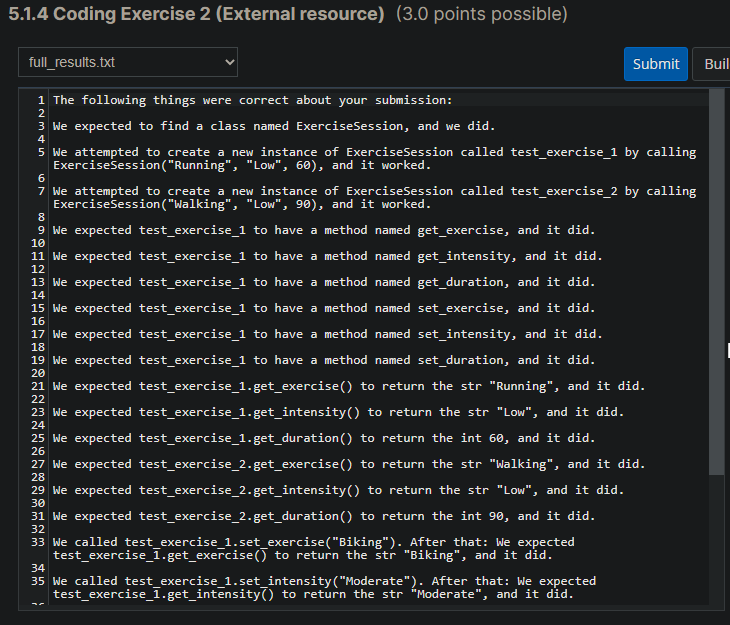

# Exercise Tracker

## Problem Description

Imagine you're writing an exercise-tracking app like Fitbit or MyFitnessPal. Part of your app is that a user can log an exercise session by naming the exercise, the intensity, and the duration.

Write a class called ExerciseSession. ExerciseSession should have a constructor that requires two strings and an integer: the strings represent the exercise name and the exercise intensity, which will be "Low", "Moderate", or "High". The integer will represent the length of the exercise session in minutes. These should be saved in the instance of the class.

Then, add three getters to the class. The getters should be named get_exercise, get_intensity, and get_duration, and should return the exercise string, the exercise intensity, and the duration, respectively.

The setters should be named set_exercise, set_intensity, and set_duration. Each should have one parameter (besides self), which should be stored as the new value of exercise, intensity, or duration. You may assume only valid values will be passed in.

## My solution

#### exercise_tracker.py

```python
class ExerciseSession:
    def __init__(self, name, intensity, length):
        self.name = name
        self.intensity = intensity
        self.length = length
        
        
    def get_exercise(self):
        return self.name
    
    
    def get_intensity(self):
        return self.intensity
    
    
    def get_duration(self):
        return self.length
    
    
    def set_exercise(self, name):
        self.name = name
        
        
    def set_intensity(self, intensity):
        self.intensity = intensity
        
        
    def set_duration(self, length):
        self.length = length
```

#### test_exercise_tracker.py

```python
from exercise_tracker import ExerciseSession


def test_get_exercise():
    ex = ExerciseSession("one", "Low", 0)
    assert ex.get_exercise() == "one"


def test_get_intensity():
    ex = ExerciseSession("one", "Low", 0)
    assert ex.get_intensity() == "Low"


def test_get_duration():
    ex = ExerciseSession("one", "Low", 0)
    assert ex.get_duration() == 0


def test_set_exercise():
    ex = ExerciseSession("one", "Low", 0)
    ex.set_exercise("two")
    assert ex.get_exercise() == "two"


def test_set_intensity():
    ex = ExerciseSession("one", "Low", 0)
    ex.set_intensity("Moderate")
    assert ex.get_intensity() == "Moderate"


def test_set_duration():
    ex = ExerciseSession("one", "Low", 0)
    ex.set_duration(10)
    assert ex.get_duration() == 10
```

## Tests



## Score



## Usage

1. Run 'python exercise_tracker.py'.