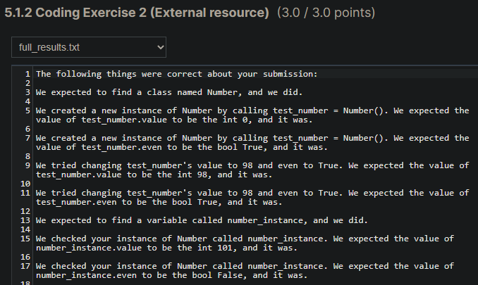

# Number class

## Problem Description

Write a class named "Number" with one attribute called "value" which defaults to 0 and another attribute called "even" which defaults to True.
Next, create an instance of this class and assign it to a variable called "number_instance". Then, set the value attribute to 101 and the even attribute to False.

## My solution

#### numbers.py

```python
def main():
    number_instance = Number()
    number_instance.value = 101
    number_instance.even = False


class Number:
    def __init__(self):
        self.value = 0
        self.even = True
```

## Score



## Usage

1. Run 'python numbers.py'.