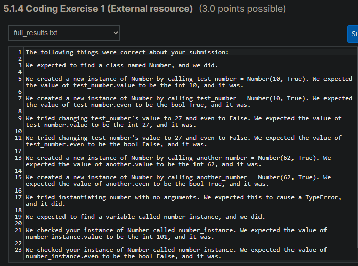

# Number class with arguments

## Problem Description

Rewrite the "Number" class from 5.1.2 Coding Exercise 2. This time, however, require arguments for value and even in the constructor. Then, inside the constructor, create new instance variables called value and even that copy the values of the arguments passed into the constructor.

## My solution

#### numbers.py

```python
def main():
    number_instance = Number(101, False)

    print(number_instance.value)
    print(number_instance.even)


class Number:
    def __init__(self, value, even):
        self.value = value
        self.even = even


if __name__ == "__main__":
    main()
```

## Score



## Usage

1. Run 'python numbers.py'.