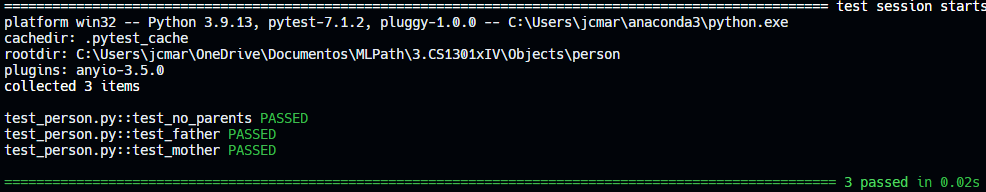

# Person

## Problem Description

Classes can also have references to other instances of themselves. Consider this Person class, for example, that allows for an instance of a father and mother to be given in the constructor.

Create 3 instances of this class. The first should have the name "Mr. Burdell" with an age of 53. The second instance should have a name of "Mrs. Burdell" with an age of 53 as well. Finally, make an instance with the name of "George P. Burdell" with an age of 25. This final instance should also have the father attribute set to the instance of Mr. Burdell, and the mother attribute set to the instance of Mrs. Burdell. Finally, store the instance of George P. Burdell in a variable called george_p. (It does not matter what variable names you use for Mr. and Mrs. Burdell.)

## My solution

#### person.py

```python
class Person:
    def __init__(self, name, age, father=None, mother=None):
        self.name = name
        self.age = age
        self.father = father
        self.mother = mother
```

#### test_person.py

```python
from person import Person


def test_no_parents():
    person = Person("Greg", 25)
    assert person.name == "Greg"
    assert person.age == 25
    assert person.father == None
    assert person.mother == None


def test_father():
    person = Person("Greg", 25, "Papa Greg")
    assert person.father == "Papa Greg"


def test_mother():
    person = Person("Greg", 25, mother="Moma Greg")
    assert person.mother == "Moma Greg"
```

## Tests



## Score


## Usage

1. Run 'python person.py'.