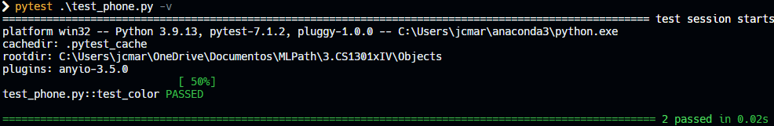
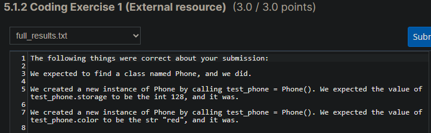

# Phone class

## Problem Description

Write a class named "Phone". The Phone class should have an attribute called "storage" which defaults to 128, and an attribute called "color" which defaults to "red".

## My solution

#### phone.py

```python
class Phone:
    def __init__(self):
        self.storage = 128
        self.color = "red"
```

#### test_phone.py

```python
from phone import Phone


# Storage
def test_storage():
    phone = Phone()
    assert phone.storage == 128


# Color
def test_color():
    phone = Phone()
    assert phone.color == "red"
```

## Tests



## Score



## Usage

1. Run 'python phone.py'.