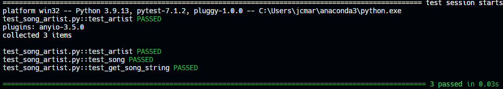
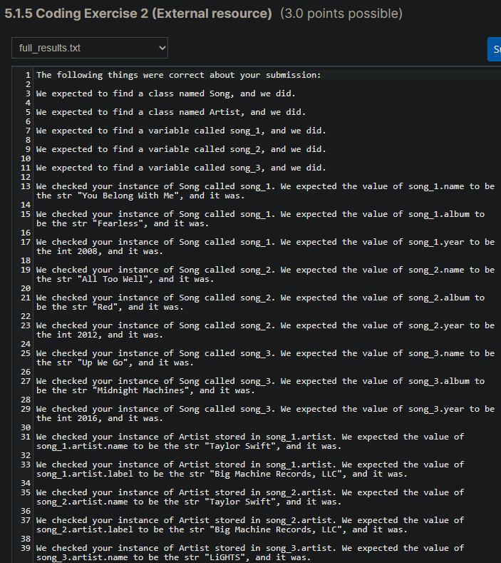

# Song Artist

## Problem Description

We've given you a class called "Song" that represents some basic information about a song. We also wrote a class called "Artist" which contains some basic information about an artist.

Your job is to create three instances of the song class, called song_1, song_2, and song_3.

Write a function called "get_song_string". It should accept one argument which will be a Song object. It should return a string in the following format:

"*song name*" - *artist name* (*song's release year*)

e.g: "You Belong With Me" - Taylor Swift (2008)

The quotation marks around the song title should be *part* of the string.

## My solution

#### song_artist.py

```python
class Artist:
    def __init__(self, name, label):
        self.name = name
        self.label = label


class Song:
    def __init__(self, name, album, year, artist):
        self.name = name
        self.album = album
        self.year = year
        self.artist = artist


def main():
    artist_1 = Artist("Taylor Swift", "Big Machine Records, LLC")
    artist_2 = Artist("LiGHTS", "Warner Bros. Records Inc.")

    song_1 = Song("You Belong With Me", "Fearless", 2008, artist_1)
    song_2 = Song("All Too Well", "Red", 2012, artist_1)
    song_3 = Song("Up We Go", "Midnight Machines", 2016, artist_2)

def get_song_string(song):
    """Returns the song's name, that of the artist and its release year"""
    return f'"{song.name}" - {song.artist.name} ({song.year})'
```

#### test_song_artist.py

```python
from song_artist import Song, Artist


def test_artist():
    artist = Artist("Some Name", "Some Label")
    assert artist.name == "Some Name"
    assert artist.label == "Some Label"


def test_song():
    artist = Artist("Some Name", "Some Label")
    song = Song("Some Song Title", "Some Album Title", 2000, artist)
    assert song.name == "Some Song Title"
    assert song.album == "Some Album Title"
    assert song.year == 2000


def test_get_song_string():
    artist = Artist("Some Name", "Some Label")
    song = Song("Some Song Title", "Some Album Title", 2000, artist)
    assert get_song_string(song) == '"Some Song Title" - Some Name (2000)'
```

## Tests



## Score



## Usage

1. Run 'python song_artist.py'.